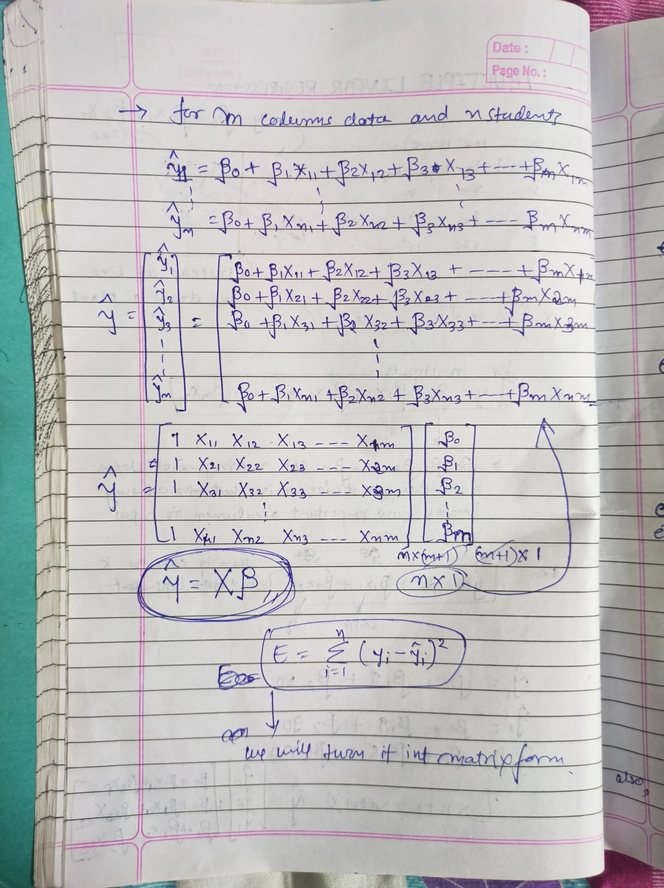
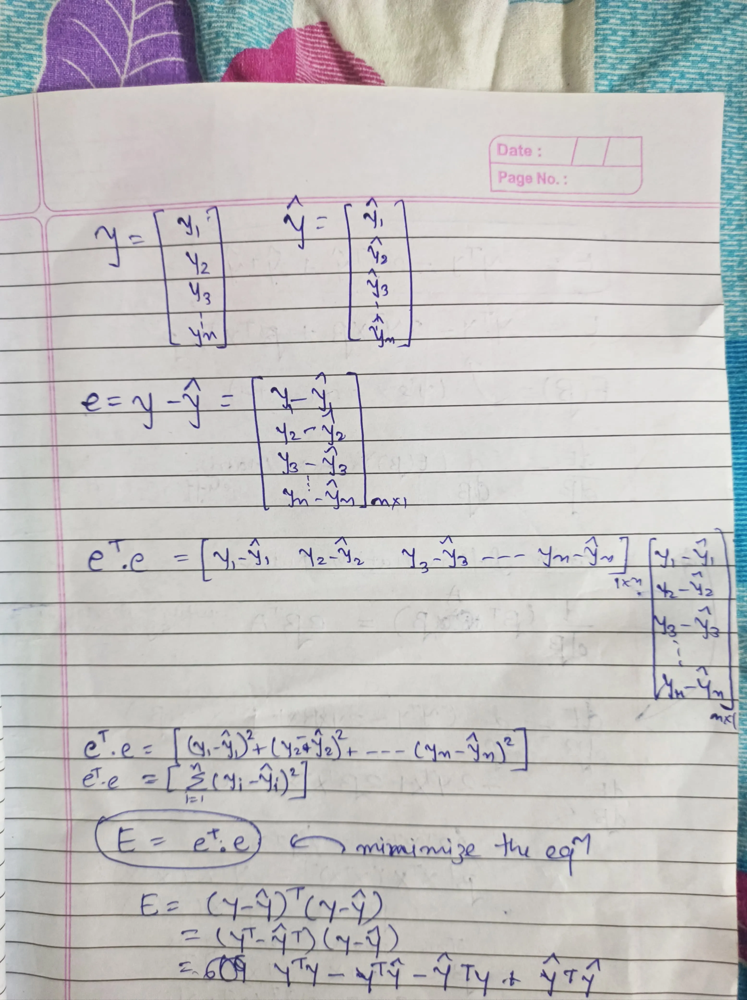
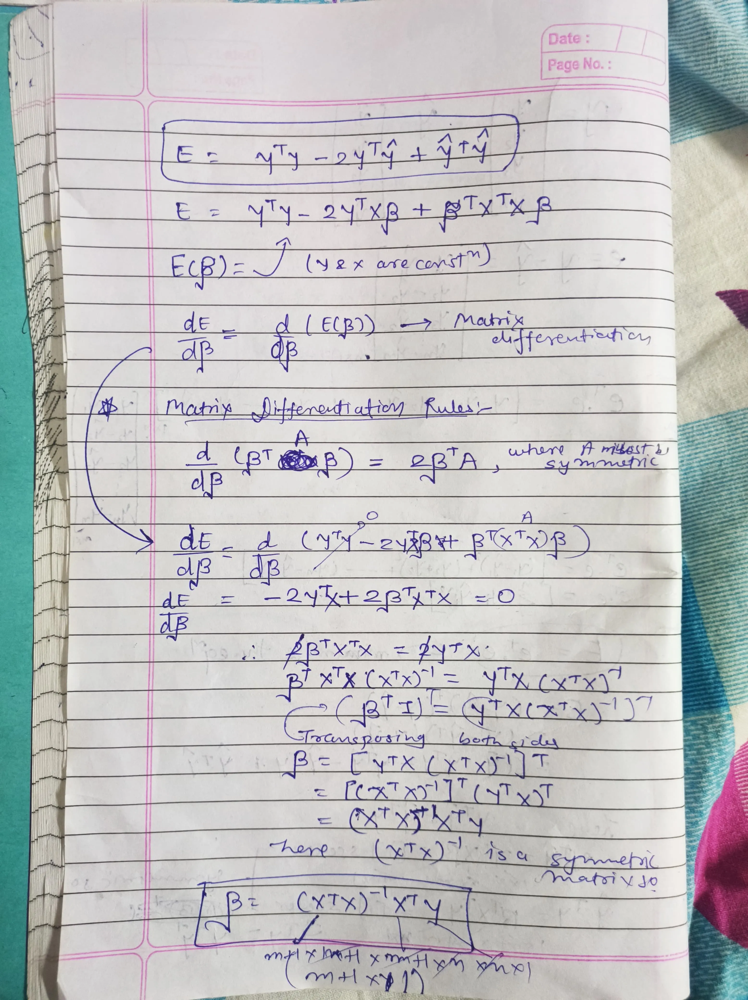
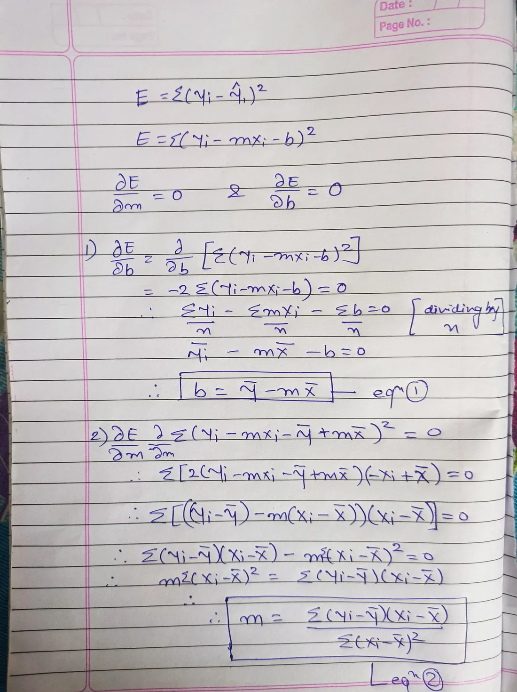

# 📈 Linear Regression (From Scratch)

This folder contains two Python implementations of Linear Regression built **completely from scratch** to deeply understand the math behind them.

- `simple_linear_regression.py` → Simple Linear Regression (1 feature)
- `multiple_linear_regression.py` → Multiple Linear Regression (multiple features)

---

## 📐 **Mathematical Explanation (with handwritten notes)**

To show how the equations and derivations come from first principles, I’ve attached my own handwritten notes:

| Topic                            | Image                                                                 |
|----------------------------------|----------------------------------------------------------------------:|
| Multiple Linear Regression (matrix form, normal equation derivation) | ![Multiple Linear Regression Derivation] |
| Continue: Matrix form & error minimization | ![Multiple Linear Regression Error] |
| Matrix differentiation & finding coefficients | ![Multiple Linear Regression Coefficients] |
| Simple Linear Regression derivation (calculating slope & intercept) | ![Simple Linear Regression Derivation]) |

These pages explain:
- How to get from the basic hypothesis to **matrix form**: $\hat{y} = X \beta$
- How to derive the **Normal Equation**: $\beta = (X^T X)^{-1} X^T y$
- For simple LR: how to find $m$ and $b$ by minimizing squared error.

---

## 💻 **Code Explanation**

### ✅ `simple_linear_regression.py`
- Implements Linear Regression for a single input feature.
- Calculates mean of X and y.
- Finds slope `m` and intercept `c` manually.
- Predicts values and shows $R^2$ score.

### ✅ `multiple_linear_regression.py`
- Works for multiple features using the **Normal Equation**.
- Adds bias term to X.
- Uses numpy to compute: $\beta = (X^T X)^{-1} X^T y$
- Predicts values and shows $R^2$ score.

---

## ⚙️ **Run**

```bash
python simple_linear_regression.py
python multiple_linear_regression.py
